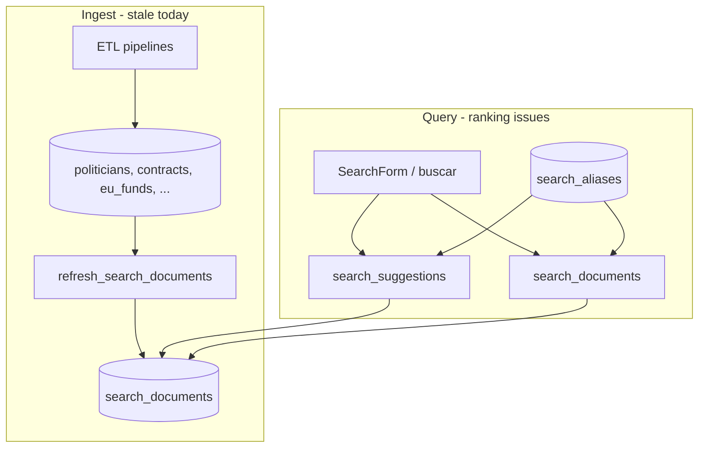
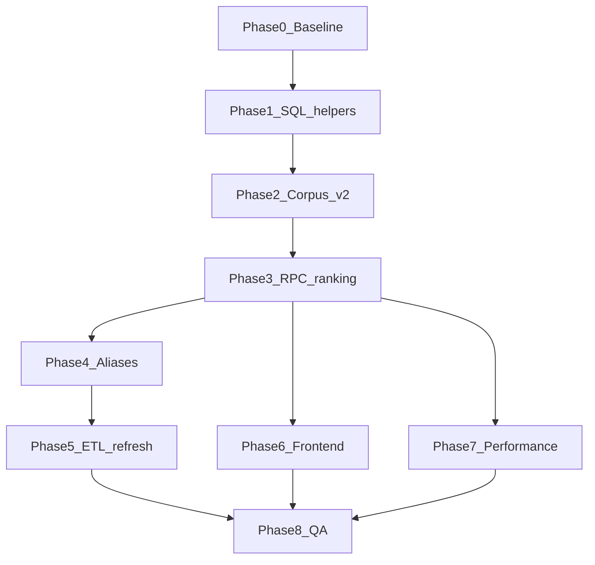

---

name: Search system overhaul

overview: "Iterative, agent-driven overhaul of España Transparente search: shared SQL scoring, person-aware ranking, display names and aliases, corpus deduplication, performance hardening, ETL refresh wiring, and frontend alignment—delivered as ordered PR-sized steps with verification gates."

todos:

  - id: phase-0-baseline

    content: "Phase 0: Add search regression script + baseline assertions (Pedro, Pedro Sanchez, Sanchez, fiscal queries)"

    status: pending

  - id: phase-1-sql-helpers

    content: "Phase 1: Migration 20260523000000 — *search*normalize_query, *search*display_name, prefix score, intent, entity boost"

    status: pending

  - id: phase-2-corpus-v2

    content: "Phase 2: Migration 20260523010000 — display_title column, refresh_search_documents v2, current gobierno only, vector weights"

    status: pending

  - id: phase-3-rpc-ranking

    content: "Phase 3: Migration 20260523020000 — refactor search_suggestions + search_documents with shared ranking and two-stage full search"

    status: pending

  - id: phase-4-aliases

    content: "Phase 4: Migration 20260523030000 + search_aliases.yml + ETL loader for generated/curated person aliases"

    status: pending

  - id: phase-5-etl-refresh

    content: "Phase 5: common/search_[refresh.py](http://refresh.py) + hook into daily/weekly CI pipelines + CLI"

    status: pending

  - id: phase-6-frontend

    content: "Phase 6: Dedupe by entity id in suggest API; show official_name subtitle; align SearchResult types"

    status: pending

  - id: phase-7-perf

    content: "Phase 7: Indexes + two-stage EXPLAIN validation; document deploy/refresh ops"

    status: pending

  - id: phase-8-qa

    content: "Phase 8: Run regression script, build, pytest, dogfood autocomplete + /buscar on preview"

    status: pending

isProject: false

---

# Search system overhaul (full plan)

## Current architecture



**Known production behavior** (verified on live Supabase):

- `Pedro Sánchez` is indexed as `Sánchez Pérez-Castejón, Pedro` `politician`, `government_position`, `vote_divergence`).

- Query `Pedro` returns ~24 `eu_fund` / senator rows (rank ~4.0+); PM ranks ~2.2 and is cut off.

- `search_documents('Pedro Sanchez')` can hit **statement timeout**; `search_suggestions` caps at 50 rows.

**Root cause:** one ranking function treats all `entity_type`s as title-prefix matches; corpus refresh runs only in [migration](supabase/migrations/20260522000000_search_documents.sql), not in ETL.

---

## Guiding principles (from [[AGENTS.md](http://AGENTS.md)]([AGENTS.md](http://AGENTS.md)))

- UI shows **factual data only** — reordering `Apellidos, Nombre` → `Nombre Apellidos` for display/search is OK; no editorial labels.

- Prefer **SQL corpus changes** over client-side hacks so autocomplete and `/buscar` stay consistent.

- Each phase = **one focused PR** (or commit series) with a verification checklist before the next agent starts.

---

## Phase 0 — Baseline and fixtures (Agent: `explore` + `shell`)

**Goal:** Lock acceptance criteria so later agents can prove fixes.

**Tasks:**

1. Add a small **search regression script** (no secrets in repo): `etl/scripts/search_regression.sh` or `web/scripts/search-check.mjs` that reads env vars and calls:

  - `search_suggestions('Pedro', 50)`

  - `search_suggestions('Pedro Sanchez', 12)`

  - `search_documents('Pedro', …, 24)`

  - `search_documents('Sanchez', …, 24)`

2. Document expected assertions in script comments:

  - `Pedro` top 12 includes at least one row with `entity_type` in `politician|government_position` and title/metadata matching Sánchez Pérez-Castejón.

  - `Pedro Sanchez` suggest top 5 includes that person **above** `eu_fund` noise.

  - `search_documents('Pedro Sanchez')` completes under 5s (no timeout).

3. Capture current output to `etl/tests/fixtures/search_baseline.json` (optional, for diff).

**Gate:** Script runs locally with `.env.local` / CI env; records pass/fail counts.

---

## Phase 1 — Shared SQL primitives (Agent: `generalPurpose`, Postgres focus)

**Goal:** One source of truth for scoring and name handling; stop duplicating logic across RPCs.

**New migration:** `supabase/migrations/20260523000000_search_ranking_helpers.sql`

**Add immutable helpers:**

| Function                                         | Purpose                                                                                                                            |

| ------------------------------------------------ | ---------------------------------------------------------------------------------------------------------------------------------- |

| `_search_normalize_query(text)`                  | `unaccent`, collapse spaces, strip stopwords (move regex from both RPCs here)                                                      |

| `_search_display_name(text)`                     | If `,` present → `Nombre Apellidos` via split; else passthrough. Mirror [parse_spanish_full_name](etl/src/common/[utils.py](http://utils.py)) in SQL. |

| `_search_title_prefix_score(title, query)`       | Replace naive `title LIKE query%` with **max** of: full-title prefix, **any-token** prefix `\mword`), display-name prefix         |

| `_search_query_intent(text)`                     | Returns `person`, `org`, `fiscal`, or `general` using token count + regex (no ML): e.g. 1–3 alpha tokens, no digits, no `contrato  |

| `_search_entity_type_boost(entity_type, intent)` | e.g. `person` → +1.5 politician/senator/government_position/institution, −1.0 eu_fund; `fiscal` → boost contract/subsidy/budget    |

**Do not** edit old migrations in place; only add new migration that `CREATE OR REPLACE`s RPCs in later phases.

**Gate:** `SELECT searchdisplay_name('Sánchez Pérez-Castejón, Pedro')` → `Pedro Sánchez Pérez-Castejón` (or agreed format); intent tests via SQL in migration comment or pytest against local Supabase.

---

## Phase 2 — Corpus refresh: display names, vectors, dedup (Agent: `generalPurpose`)

**Goal:** Index what users type; reduce duplicate government rows.

**New migration:** `supabase/migrations/20260523010000_search_corpus_v2.sql`

**Changes to `refresh_search_documents()`** in [20260522000000_search_documents.sql](supabase/migrations/20260522000000_search_documents.sql) pattern:

1. **Optional column** `display_title text` on `search_documents` (nullable; fallback `title` in RPCs via `coalesce(display_title, title)`).

2. For `politician`, `senator`, `government_position`, `institution`, `revolving_door`, `vote_divergence`:

  - `display_title = searchdisplay_name(person_name_or_full_name)`

  - `metadata.official_name` = original string

3. **Extend `search_vector`** with `setweight(to_tsvector('simple', unaccent(display_title)), 'A')` for person-like types.

4. **Government positions:** index only **current** roles in search corpus:

  - `WHERE gp.end_date IS NULL OR gp.end_date >= current_date`

  - Or `DISTINCT ON (gp.politician_id)` / `person_name` keeping latest `start_date` (document choice in PR description).

5. **Vote divergences:** keep rows but lower `weight` (e.g. 6) so they don’t crowd person results; still link from diputado profile.

6. Run `SELECT refresh_search_documents();` at end of migration.

**Gate:** `search_documents` row for Pedro has `display_title` containing `Pedro`; only one current `government_position` row per person in corpus.

---

## Phase 3 — Unified ranking in RPCs (Agent: `generalPurpose`)

**Goal:** Fix Pedro-style queries in **both** autocomplete and full search.

**New migration:** `supabase/migrations/20260523020000_search_rpc_ranking.sql`

**Refactor `search_suggestions` and `search_documents`** ([20260522010000_search_suggestions.sql](supabase/migrations/20260522010000_search_suggestions.sql), [20260522000000_search_documents.sql](supabase/migrations/20260522000000_search_documents.sql)):

### Shared rank expression (pseudocode)

```

score =

  ts_rank_cd(search_vector, ts_q)

  + *search*title_prefix_score(coalesce(display_title, title), query)

  + similarity(unaccent(coalesce(display_title, title)), query)

  + (weight / 10)

  + *search*entity_type_boost(entity_type, intent)

```

### `search_suggestions` changes

- Use shared helpers; keep FTS candidate cap (120) but **pre-filter by intent** when `intent = 'person'`: candidate union = person types first (limit 80), then others (limit 40).

- Return `title` as `coalesce(display_title, title)`; keep `metadata.official_name` for detail pages if needed.

- Raise cap only if needed (50 → 80) after perf check.

### `search_documents` changes

- **Two-stage query** to fix timeouts:

  1. `candidates` CTE: FTS + trigram on **title/display_title only** (not `body`), `LIMIT 200` ordered by score.

  2. Final select applies `LIKE` on body only for candidates already in CTE (or drop body `LIKE` for queries with ≥2 tokens).

- Apply same rank expression as suggestions.

- Keep filters `min_amount`, `year`).

**Gate:** Regression script from Phase 0 passes; manual check: `Pedro` top results include PM; `contrato pedro` still finds contracts (intent `fiscal` or `general`).

---

## Phase 4 — Aliases: generated + curated (Agent: `generalPurpose` + `explore`)

**Goal:** Bridge typos, common names, and roles without editorializing.

**4a — Generated aliases (SQL in migration `20260523030000_search_aliases_generated.sql`)**

After each `refresh_search_documents()`, run `refresh_search_person_aliases()`:

- For each person-like `search_documents` row with `politician_id` or stable `entity_id`:

  - Insert into `search_aliases`: `display_title`, first token only `Pedro`), first+last surname cluster if parseable.

  - `ON CONFLICT DO NOTHING`; `entity_type` + `entity_id` required (fix existing curated rows that use `entity_type` only).

**4b — Curated aliases (data file)**

- Add [etl/data/search_aliases.yml](etl/data/search_aliases.yml) (factual nicknames / common spellings only, e.g. `Pedro Sanchez` → politician id or canonical name).

- ETL loader `etl/src/common/search_aliases.py` upserts into `search_aliases` with `source = 'curated'`.

- Seed ~10–20 high-traffic figures (PM, opposition leaders) — not an open-ended list.

**4c — Wire alias scoring**

- In RPCs, alias hit adds fixed boost (+2) and resolves to linked `search_documents` row.

- Fix alias EXISTS clause in `search_documents` to require `entity_id` match when alias has one (today can over-match).

**Gate:** `search_suggestions('Pedro Sanchez')` returns PM in top 3; `search_suggestions('PSOE')` unchanged (party acronym still works via existing logic).

---

## Phase 5 — ETL: keep corpus fresh (Agent: `shell` + `generalPurpose`)

**Goal:** Search index updates when data updates.

**Tasks:**

1. Add `etl/src/common/search_refresh.py`:

  ```python

   def refresh_search_corpus(cur): cur.execute("SELECT refresh_search_documents()")

   def refresh_search_aliases(cur): cur.execute("SELECT refresh_search_person_aliases()")

  ```

2. Call at end of daily/weekly pipelines in [.github/workflows/ci.yml](.github/workflows/ci.yml) after writes:

  - `diputados`, `gobierno`, `responsables`, `senadores`, `contratos`, `subvenciones`, `kohesio.fondos_ue` (at minimum).

3. Add CLI: `PYTHONPATH=src python -m common.search_refresh` for manual ops.

4. Extend [etl/tests/test_search_[index.py](http://index.py)](etl/tests/test_search_[index.py](http://index.py)) with tests for `display_name` helper in Python (mirror SQL semantics).

**Gate:** After a dry-run ETL locally, `search_documents.updated_at` advances; CI does not require refresh on PR build (too heavy) but documents manual `db push` + refresh for deploy.

---

## Phase 6 — Frontend alignment (Agent: `generalPurpose`, web)

**Goal:** UI reflects improved API; no duplicate ranking logic.

**Files:**

- [web/src/app/api/search/suggest/route.ts](web/src/app/api/search/suggest/route.ts): dedupe by `entity_type:id` (not `title`); optional intent hint later—prefer SQL-only for now.

- [web/src/components/search/SearchForm.tsx](web/src/components/search/SearchForm.tsx) / [SearchResults.tsx](web/src/components/search/SearchResults.tsx):

  - Show `title` from API (already display-oriented after Phase 3).

  - If `metadata.official_name` present, show as muted subtitle (factual, not editorial).

- [web/src/lib/data.ts](web/src/lib/data.ts):

  - Extend `SearchResult` type with `official_name?: string` from metadata if exposed.

  - Expand `inferSearchEntityTypes` for **name-like** queries (1–3 tokens, no fiscal keywords) → prefer person types **only on full search** if SQL intent is not ready in JS; ideally remove JS filtering once SQL intent is trusted.

**Gate:** Autocomplete and `/buscar` show `Pedro Sánchez Pérez-Castejón` (or agreed display form); official name visible secondary.

---

## Phase 7 — Performance and ops (Agent: `generalPurpose` + `ci-investigator` if needed)

**Goal:** No timeouts at scale; observable search health.

**Tasks:**

1. Indexes (migration `20260523040000_search_perf.sql`):

  - `GIN` on `to_tsvector('simple', unaccent(coalesce(display_title, title)))` if expression index needed, or rely on existing `search_vector` after Phase 2.

  - Consider `pg_trgm` index on `display_title`.

2. Set `statement_timeout` inside RPC only for `search_documents` candidate CTE (e.g. 8s) with graceful empty return + log — or rely on two-stage limit.

3. Document in [web/README](web/README) or existing ops doc: deploy order = `npx supabase db push` → run refresh RPC or wait for nightly ETL.

**Gate:** Regression script: `search_documents('Pedro Sanchez')` < 3s on production; EXPLAIN on candidate CTE uses GIN index.

---

## Phase 8 — QA and ship (Agent: `gstack-qa` or manual browse)

**Checklist:**

| Query              | Expected                        |

| ------------------ | ------------------------------- |

| `Pedro`            | PM / diputados in top 8 suggest |

| `Pedro Sanchez`    | PM #1–3                         |

| `Sanchez`          | PM in top 5 among Sánchezes     |

| `contrato sanidad` | Contracts, not people           |

| `BDNS`             | Subsidies / alias               |

| `PSOE`             | Party                           |

- Run `npm run build` in `web/`.

- Run `pytest etl/tests/test_search_index.py`.

- Dogfood header search + `/buscar` on Vercel preview.

---

## Agent execution order



| Phase  | Subagent                   | Read-only? | Primary outputs              |

| ------ | -------------------------- | ---------- | ---------------------------- |

| 0      | `explore` + `shell`        | yes/no     | regression script + baseline |

| 1–4, 7 | `generalPurpose`           | no         | Supabase migrations          |

| 5      | `shell` + `generalPurpose` | no         | ETL module + CI hook         |

| 6      | `generalPurpose`           | no         | web/ changes                 |

| 8      | `gstack-qa` or browse MCP  | yes        | sign-off checklist           |

**Handoff rule:** Each agent opens with “run regression script”; ends with “paste script output + migration names applied”.

---

## Risk register

| Risk                               | Mitigation                                                   |

| ---------------------------------- | ------------------------------------------------------------ |

| Migration drift on hosted Supabase | Single `db push` after Phase 3; re-run refresh               |

| Over-boosting common first names   | Intent detector + alias only for linked `entity_id`          |

| Breaking contract search           | Regression cases for fiscal keywords                         |

| Display name wrong for edge cases  | Keep `official_name` in metadata; title stays reversible     |

| ETL refresh slow                   | Run async after weekly only if daily too heavy; log duration |

---

## Out of scope (defer)

- Semantic / embedding search `pgvector`).

- Search across `source_document_chunks` in main UI (table exists, weight 4).

- Per-user search analytics.

---

## Success criteria (project done)

1. Phase 0 regression script passes against production Supabase.

2. Pedro Sánchez discoverable by first name, full name, and surname in suggest + `/buscar`.

3. No statement timeout on typical two-word person queries.

4. Corpus refresh runs automatically after ETL (or documented manual step until CI secret wired).

5. No [AGENTS.md](http://AGENTS.md) violations in UI copy.

